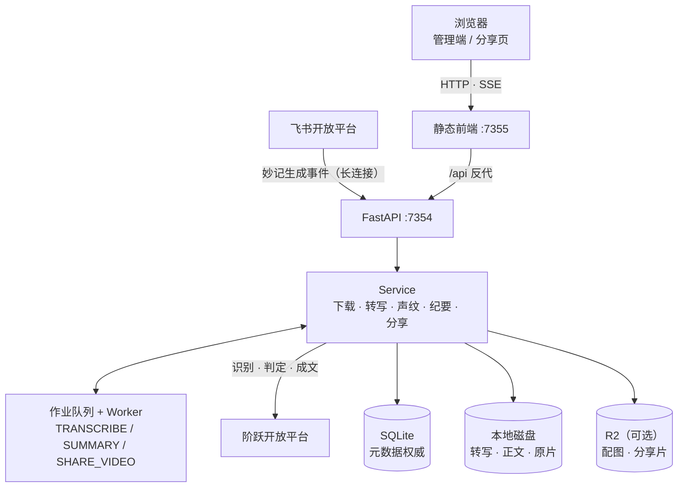
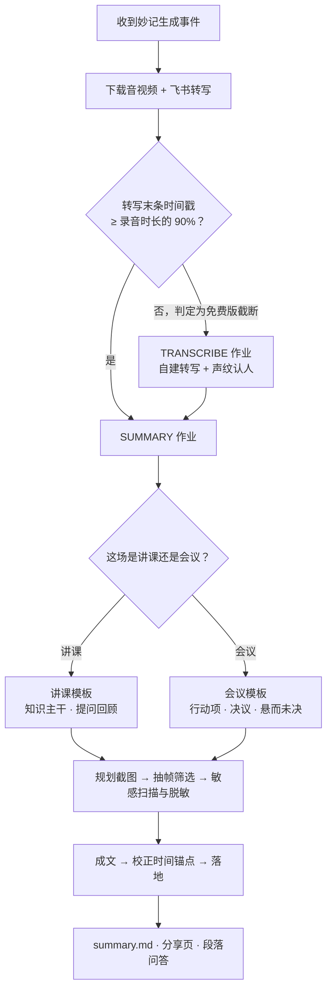
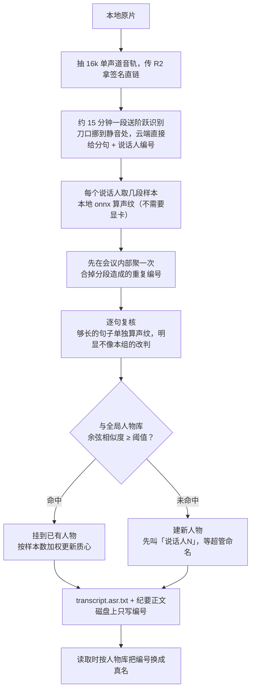

# 飞书妙记自动化

监听飞书妙记生成事件，按订阅用户自动下载音视频与转写，本地生成配图纪要（含敏感信息脱敏）；提供多用户管理端与访客分享页（密钥访问、导出、段落问答）。飞书免费版转写只有前几分钟，这种情况下会自动改走自建转写，并用声纹把说话人对到全局人物库。可选接入 **Cloudflare Tunnel（公网入口）** 与 **R2（媒体加速）**。

许可证：[GNU General Public License v3.0](LICENSE)（GPL-3.0）。

## 架构



| 层 | 说明 |
|----|------|
| 元数据 | 会议记录、分享、密钥、配图/R2 状态、纪要运行、声纹人物等均以 **SQLite** 为准 |
| 本地磁盘 | `data/meetings/{owner_user_id}/{minute_token}/`：转写、纪要正文、抽帧中间态；原片在分享片上云且纪要完成后清理 |
| R2（可选） | 配图、压缩分享视频、自建转写的音轨中转；播放优先签名 URL，未就绪时回落本地 |

资源按 `(owner_user_id, minute_token)` 隔离。前端 `apiBase` 为当前站点 `/api/v1`；本地由 `serve.py` 反代，公网由 Tunnel 路径分流。

### 一场妙记走完的路

耗时长的环节都拆成作业落库，由 Worker 主循环消费，页面断开也不影响进度。



判不出场景就直接中止，不猜模板——两套结构差得远，猜错整篇都跑偏。

## 当前能力

- 飞书 SDK **WebSocket 长连接**收 `minutes.minute.generated_v1`（无需公网 Webhook）
- **多用户**：账号密码 / 飞书 SSO 登录；邀请码建号；侧栏手势解锁超级管理员
- 管理端：云端列表、本地下载与纪要进度、密钥/分享管理、用户与**系统配置**（超管）
- 事件下载：**仅对事件订阅者映射到的本地用户**落盘，避免无关账号重复下载
- 自动下载音视频 + 转写；可自动生成配图纪要（需本机 `ffmpeg`/`ffprobe`）
- 飞书转写被截断时自动改走**自建转写**，并用**声纹**把说话人对到全局人物库（详见下文）
- 成文前由模型判定录音是**讲课**还是**会议**，两套纪要模板与配图侧重各不相同；判不出就中止，不猜模板
- 配图敏感扫描 → 马赛克 → 复核；分享页/详情支持访问票读图
- 分享：公开 / 需密钥、可导出；访客可记住密钥；侧栏「可访问课程」按**妙记生成时间**排序
- 段落问答：基于转写/纪要上下文的访客提问（受分享权限约束）
- 可选 Cloudflare：Named Tunnel；R2 托管配图与压缩分享视频

## 本地目录（每个妙记）

```
data/meetings/{owner_user_id}/{minute_token}/
├── raw/
│   ├── media/              # 原片（纪要完成且分享片上云后可删除）
│   └── transcript/         # 飞书原文 transcript.txt；自建转写另存 transcript.asr.txt（优先读它）
├── agent/                  # 抽帧、自建转写切片等中间产物（可随时清）
└── output/
    ├── assets/             # 配图（同步 R2 后可删本地）
    └── summary.md
```

会议/分享/R2 同步等元数据在 `data/app.db`，不再以目录内 `meta.json` 为权威。

## 快速开始（仅本机）

```bash
python -m venv .venv
.venv\Scripts\activate          # Windows
pip install -r requirements.txt

# 复制并填写 .env（至少 FEISHU_*、JWT_SECRET、ADMIN_TOKEN、LLM_*）
copy .env.example .env

# 终端 1：后端
python -m app.main

# 终端 2：前端
python frontend/serve.py
```

- 前端：<http://127.0.0.1:7355>
- 后端：<http://127.0.0.1:7354>
- 登录：注册/邀请码建号，或飞书 SSO；超管口令为 `.env` 的 `ADMIN_TOKEN`（侧栏手势解锁，不是普通登录密码）

本机调试建议：

```env
FRONTEND_ORIGIN=http://127.0.0.1:7355
API_PUBLIC_BASE=http://127.0.0.1:7355
R2_ENABLED=false
```

`.env` 中密钥类项常驻；下载并发、纪要/脱敏/R2 画质等业务阈值首次启动写入 `system_configs`，之后以超管「系统配置」页为准（详见 `.env.example` 分区注释）。

---

## 自建转写与声纹

飞书免费版只转写录音的前几分钟，剩下的只给完整音视频。拿一份三分钟的转写去概括一小时的会，写出来的纪要没法看，而用户自己察觉不到。所以下载完成后会先算一次覆盖率——转写末条时间戳除以录音时长——低于阈值就判定为截断，改走这条链路，跑完再进纪要。



几点值得知道的：

- **飞书原文不覆盖。** 自建转写另存 `transcript.asr.txt`，读取时优先它，飞书的 `transcript.txt` 原样保留。
- **改名立刻全站生效，纪要也算在内。** 磁盘上转写与纪要正文写的都是会议内稳定编号，真名在读取时现查现换，所以超管改一次名，历史会议的转写页、纪要、导出件一起变，不用重跑任何东西。为此提示词要求模型称呼参会人时原样照抄转写里的标识，不许改写成「第二位发言人」这类说法。
- **纪要正文不走 R2 直链。** 换名发生在服务端，直链会绕过去。自建转写的会议，纪要与转写都由后端内联返回；飞书转写的会议不受影响。
- **重跑转写会连带重跑纪要。** 说话人编号是每次转写重新排的，旧纪要的编号会对到新人身上，所以转写作业跑完会强制重生成纪要。
- **人物库全站共享，只有超管能命名。** 超管侧栏有「声纹人物」页，可以列出人物、试听样本、命名、合并、删除；会议详情页的转写侧也有就地改名入口。普通用户只看结果。
- **只对新会议生效。** 历史会议不自动补跑，需要时手动重下触发。

### 启用

```bash
# 拉声纹嵌入模型（几十兆，不进仓库；国内默认走 HuggingFace 镜像）
python scripts/download_speaker_model.py
```

`.env` 里对应这几项，密钥留空会复用 `LLM_API_KEY`：

```env
STEP_ASR_ENABLED=true
STEP_ASR_API_KEY=
TRANSCRIPT_COVERAGE_THRESHOLD=0.9
SPEAKER_MATCH_THRESHOLD=0.55
SPEAKER_EMBEDDING_MODEL_PATH=models/3dspeaker_speech_campplus_sv_zh-cn_16k-common.onnx
```

除密钥和模型路径外，覆盖率与声纹阈值都属于业务阈值，首次启动写入 `system_configs`，之后改超管「系统配置」页即可，不必重启。

匹配阈值 0.55 是拿真实录音试出来的：同一个人跨会议的质心相似度最低 0.68，不同人之间最高 0.42，取中间且偏保守，宁可判成新人也不要把两个人并成一个。

逐句复核是为了补云端分离的一个短板：它只在单次调用内部分人，两个人声音接近时会把整句安错，而声纹层是按「组」取样的，错的句子会一直跟着错的组走。所以够长的句子会单独算一次声纹，跟本场各人的质心比，明显更像别人才改判。门槛（`SPEAKER_VERIFY_MARGIN`）留得高，宁可漏掉几句，也不要把本来对的搅乱；太短的句子声纹不稳，直接跳过。

分段是因为整段几十分钟送上去会被识别服务拒收。切点不是按整数倍硬切：在 15 分钟处前后各 15 秒找一段静音，把刀口挪到没人说话的地方，找不到才留在原位。硬切会把一句话劈成两半，两边各得到一个残缺分句，接缝处的人还会因为分属两次调用而多出一个待认的候选。单段被拒会先原样重试，再不行才对半切——切得越碎，云端给的说话人编号越独立，反而更难认人。

这条链路依赖 R2（音频要有公网直链给识别服务）与本机 `ffmpeg`。关掉 `STEP_ASR_ENABLED` 就退回只用飞书转写。

---

## 接入 Cloudflare（重点）

公网访问需要 **Tunnel**；分享/播放媒体要快再加 **R2**。可只开 Tunnel，也可 Tunnel + R2。

### 总览

| 组件 | 作用 | 本项目用法 |
|------|------|------------|
| Named Tunnel | 把本机 7355/7354 暴露为 HTTPS | **推荐单域名**：`/api*`→7354，其余→7355 |
| R2 | 对象存储 | 配图 + 压缩分享视频；私有桶 + 短时签名 URL |

示例域名：

- 同域（推荐）：`https://larkmeeting.example.com`  
  - `/api*` → `http://127.0.0.1:7354`  
  - 其余 → `http://127.0.0.1:7355`  
- 本地：`python frontend/serve.py` 已反代 `/api/*` → 7354

示例 ingress 见 [`cloudflared.ingress.example.yml`](cloudflared.ingress.example.yml)。浏览器直连 R2 时需桶 CORS 允许前端 Origin（可参考 [`scripts/r2_browser_cors.example.json`](scripts/r2_browser_cors.example.json)，按实际域名改后下发到桶）。

---

### A. Cloudflare Tunnel（公网入口）

#### 1. 安装 cloudflared

```powershell
winget install --id Cloudflare.cloudflared -e
```

常见路径：`C:\Program Files (x86)\cloudflared\cloudflared.exe`

#### 2. 控制台创建 Named Tunnel

1. 打开 [Zero Trust → Networks → Tunnels](https://one.dash.cloudflare.com/)
2. **Create a tunnel** → Cloudflared → 命名（如 `feishu-minutes`）
3. 复制安装命令中的 token，管理员权限执行：

```powershell
& "C:\Program Files (x86)\cloudflared\cloudflared.exe" service install "<TOKEN>"
Start-Service Cloudflared
```

4. 添加 **Public Hostname**（同一 hostname 两条，**带 path 的靠前**）：

| Public hostname | Path | Service |
|-----------------|------|---------|
| `larkmeeting.example.com` | `/api*` | `http://127.0.0.1:7354` |
| `larkmeeting.example.com` | （空） | `http://127.0.0.1:7355` |

#### 3. 改项目 `.env`

```env
FRONTEND_ORIGIN=https://larkmeeting.example.com
API_PUBLIC_BASE=https://larkmeeting.example.com
```

前端 [`config.js`](frontend/assets/config.js) 使用 `${location.origin}/api/v1`，一般无需再改。重启后端使 CORS / 绝对 URL 生效。

#### 4. 飞书 OAuth / SSO 回调

开发者后台重定向 URL 请**同时保留本地与公网**，并写入 `FEISHU_OAUTH_REDIRECT_URIS`：

```
http://127.0.0.1:7355/api/v1/auth/feishu/callback
https://larkmeeting.example.com/api/v1/auth/feishu/callback
```

#### 5. 体感说明

- Tunnel：浏览器 → CF 边缘 → 回源本机，国内页面/API 可能偏慢。
- 配图与已就绪的压缩视频走 R2 后会快很多。
- 本机管理继续用 `http://127.0.0.1:7355`。

---

### B. Cloudflare R2（媒体）

#### 1. 控制台准备

1. Dashboard → **R2 Object Storage** → 启用  
2. **Create bucket**（如 `larkmeeting-share`），保持**私有**  
3. **Manage R2 API Tokens** → Object Read & Write；记下 Account ID / Access Key / Secret  

#### 2. 填写 `.env`

```env
R2_ENABLED=true
R2_ACCOUNT_ID=你的AccountID
R2_ACCESS_KEY_ID=...
R2_SECRET_ACCESS_KEY=...
R2_BUCKET=larkmeeting-share
```

画质与签名 TTL（`R2_SIGNED_URL_TTL_SECONDS`、`R2_VIDEO_*`）可在 `.env` 种子或「系统配置」中调整。`R2_ENABLED=true` 且密钥齐全后才会上传/签名。

#### 3. 行为说明

| 时机 | 行为 |
|------|------|
| 配图生成并脱敏后 | 上传 R2，DB 登记；可删本地配图 |
| 下载完成后 | 后台压成分享片 → 上传 `…/share/video.mp4` |
| 纪要完成且分享片 READY | 清理本地原片（避免磁盘堆积） |
| 播放 / 分享读图 | 优先 R2 签名 URL；未就绪回落本地 |

压缩默认：高度 ≤720、`libx264` + `veryfast` + CRF 32、AAC 64k、`+faststart`。R2 对象 key 与同步状态在库表 `r2_sync_states`。

#### 4. 历史数据补传 / 清本地

```bash
set PYTHONPATH=.
.\.venv\Scripts\python.exe -u scripts\backfill_r2_media.py
.\.venv\Scripts\python.exe -u scripts\backfill_r2_media.py --token <minute_token>

# R2 已同步后清理本地媒体（慎用）
.\.venv\Scripts\python.exe scripts\purge_local_media_after_r2.py
```

#### 5. 免费额度提示

R2 每月约有 **10GB 存储** 与读写操作免费额度（以官网为准）。压缩后体积远小于原片，建议只长期存分享链路所需对象。

---

### C. 配置检查清单

1. Tunnel 服务 Running；同域 `/api*`→7354、其余→7355  
2. `FRONTEND_ORIGIN` / `API_PUBLIC_BASE` 为同一公网域名  
3. 需要媒体加速：`R2_ENABLED=true`，桶 CORS 允许前端 Origin，重启后端  
4. 分享页配图 401：确认已拿到访问票再渲染纪要（当前前端会先取票）  
5. 本机管理用 `127.0.0.1:7355`，Network 里 API 走同域 `/api/v1`

---

## 飞书开发者后台

### 所需权限

| 权限 | 用途 |
|------|------|
| `minutes:minutes.basic:read` | 妙记基本信息 + 订阅生成事件 |
| `minutes:minutes.search:read` | 搜索云端列表 |
| `minutes:minutes.media:export` | 下载音视频 |
| `minutes:minutes.transcript:export` | 导出转写 |
| `offline_access` | 刷新用户授权 |

### 用户 OAuth / SSO

搜索、订阅、下载走 `user_access_token`。登录与回调按当前访问主机动态选择。请在开放平台**同时登记**本地与公网回调，并写入 `FEISHU_OAUTH_REDIRECT_URIS`，例如：

```
http://127.0.0.1:7355/api/v1/auth/feishu/callback
http://127.0.0.1:7354/api/v1/auth/feishu/callback
https://larkmeeting.example.com/api/v1/auth/feishu/callback
```

`FEISHU_SSO_REQUIRE_INVITE=true` 时，飞书建号需带邀请参数。

### 事件订阅

1. 先启动本服务，日志出现长连接成功  
2. 开发者后台 → 事件配置 → **长连接接收事件**  
3. 订阅 `minutes.minute.generated_v1`  
4. 用户 OAuth 登录后会自动调用「订阅妙记变更」  
5. 事件到达后，仅为映射到本地账号的订阅者触发下载

## 常用脚本

| 脚本 | 说明 |
|------|------|
| `scripts/download_speaker_model.py` | 拉声纹嵌入模型（启用自建转写前跑一次） |
| `scripts/backfill_r2_media.py` | 补传配图/压缩视频到 R2 |
| `scripts/purge_local_media_after_r2.py` | R2 已同步后清理本地媒体 |
| `scripts/migrate_filesystem_meta_to_db.py` | 旧版目录 JSON 元数据迁入 SQLite |
| `scripts/migrate_storage_to_owner_paths.py` | 存储路径迁到 `{owner}/{token}` |
| `scripts/migrate_aux_tables_owner_keys.py` | 附属表补齐 owner 维度 |
| `scripts/cleanup_filesystem_meta.py` | 清理已迁库的残留 meta 文件 |
| `scripts/_e2e_replay_minute.py` | 联调：清理并重放指定妙记下载（`--token`/`--owner` 必填） |
| `python -m app.main` | 后端 |
| `python frontend/serve.py` | 前端（含 `/api` → 7354 反代） |

## 相关文档

- [处理事件 - Python SDK](https://open.feishu.cn/document/server-side-sdk/python--sdk/handle-events)  
- [订阅妙记变更](https://open.feishu.cn/document/uAjLw4CM/ukTMukTMukTM/minutes-v1/minute/subscription)  
- [Cloudflare Tunnel](https://developers.cloudflare.com/cloudflare-one/connections/connect-apps/)  
- [Cloudflare R2](https://developers.cloudflare.com/r2/)
