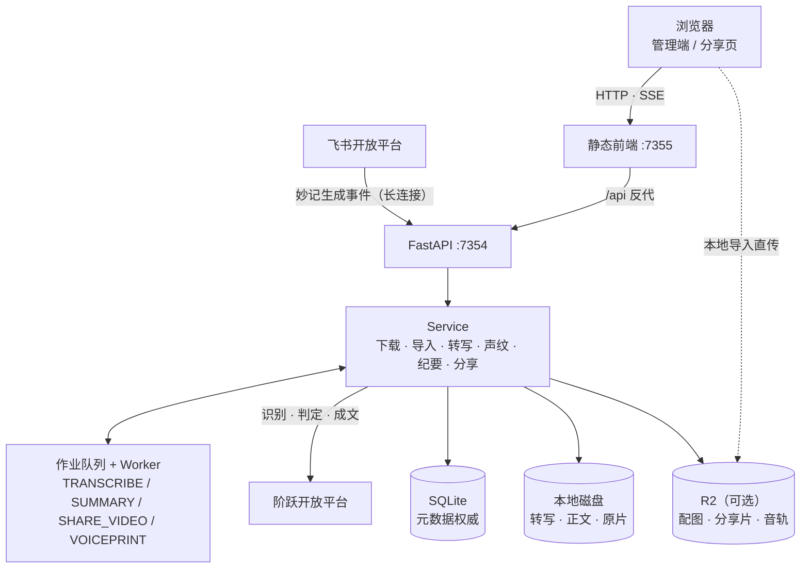
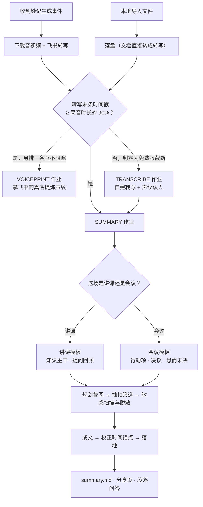

# 架构与数据流

部署与配置看 [根目录 README](../README.md)，这里只讲系统长什么样、一场妙记怎么走完全程。

## 分层



| 层 | 说明 |
|----|------|
| 元数据 | 会议记录、分享、密钥、配图/R2 状态、纪要运行、声纹人物等均以 **SQLite** 为准 |
| 本地磁盘 | `data/meetings/{owner_user_id}/{minute_token}/`：转写、纪要正文、抽帧中间态；原片在分享片上云且纪要完成后清理 |
| R2（可选） | 配图、压缩分享视频、自建转写的音轨中转、本地导入的直传落点；播放优先签名 URL，未就绪时回落本地。详见 [媒体存储](media-storage.md) |

资源按 `(owner_user_id, minute_token)` 隔离。前端 `apiBase` 为当前站点 `/api/v1`；本地由 `serve.py` 反代，公网由 Tunnel 路径分流。

## 一场妙记走完的路

耗时长的环节都拆成作业落库，由 Worker 主循环消费，页面断开也不影响进度。



判不出场景就直接中止，不猜模板——两套结构差得远，猜错整篇都跑偏。

各分支的细节另开一篇：

- 覆盖率判定与自建转写 → [自建转写与声纹](transcription-and-voiceprint.md)
- 沿用飞书转写时顺手提炼声纹 → [从飞书姓名自动建声纹](voiceprint-harvest.md)
- 人工改判用哪套转写 → [手动切换转写引擎](transcript-engine-switch.md)
- 不在飞书上的录音与文档 → [本地导入](local-import.md)

## 作业队列

入队之前会先看这场会议实际有什么：没有视频就不排压分享片的作业，没有音频就不排自建转写，纯音频会议也不去规划截图。这些作业排下去必定做不成，而做不成的原因不是「坏了」而是「这场会议没这个东西」，留一条红的在列表里只会让人白排查。已经跑起来才发现条件不成立的（比如原片在别处被清掉了），收尾时标成 `SKIPPED` 而不是 `FAILED`，原因写在阶段那一栏里。对外仍按「这一步过了」展示，因为这一步本来就不必做。

作业类型的规则（并发上限、心跳超时、中文名）集中在 `JOB_KINDS` 一张表里，执行入口在 worker 里按同一批键分派，启动时对不上就直接起不来——少写一个入口的话，那类作业会永远排着不动，还不如起不来。

| 作业 | 并发 | 说明 |
|------|------|------|
| `SUMMARY` | 一个账号一条 | 互不影响别人；纪要是最常排的一种 |
| `TRANSCRIBE` | 全局 1 | 抽音轨、切片、跑 onnx，都吃 CPU |
| `SHARE_VIDEO` | 全局 1 | ffmpeg 压缩，超时上限跟着 `R2_VIDEO_COMPRESS_TIMEOUT_SECONDS` 走 |
| `VOICEPRINT` | 全局 1 | 与转写一个量级，但只切几段样本，快得多 |

## 本地目录（每个妙记）

```
data/meetings/{owner_user_id}/{minute_token}/
├── raw/
│   ├── media/              # 原片（纪要完成且分享片上云后可删除）
│   └── transcript/         # 飞书原文 transcript.txt；自建转写另存 transcript.asr.txt（优先读它）
├── agent/                  # 抽帧、自建转写切片等中间产物（可随时清）
└── output/
    ├── assets/             # 配图（同步 R2 后可删本地）
    └── summary.md
```

本地导入的会议在飞书上没有 `minute_token`，用 `imp` + 20 位随机十六进制当标识（如 `imp3f9c…`），目录结构与飞书会议完全一致；库里的 `event_type` 记成 `LOCAL_IMPORT`，所有飞书专属操作都靠它识别并明确拒绝。

## 元数据只有一个写入者

会议/分享/R2 同步等元数据在 `data/app.db`，不再以目录内 `meta.json` 为权威。业务代码一律按字段读写 `meeting_records`：需要旧值就读实体，改一个字段就只更新那一列。

早先那份 `meta.json` 搬进库之后，字典门面还留了一阵：存储服务上有一对 `read_meta` / `write_meta`，把松散字典塞给 `upsert_meeting_meta` 由它反猜字段。于是同一行记录有了两个写入者，合并规则还不一样——字典那条靠展开旧字典保住旧值，类型化那条靠仓储跳过没提的字段。下载完一场会议要先按字典写一遍、紧接着按字段再写一遍；本地导入还因为字典先占了行、把 `event_type` 写成 `META_BACKFILL`，撞上唯一约束。现在字典那条路只剩迁移脚本 `scripts/migrate_filesystem_meta_to_db.py` 在用，docstring 里也写明了别的地方不要再走。

配套的一个约定：更新实体的字段默认值是 `UNSET`，不是 `None`。「没提这个字段」和「把这个字段置空」得能分开表达——早先两者都写 `None`，于是置空是个静默的空操作，切换转写引擎时想把来源置空就是这么丢掉的。
