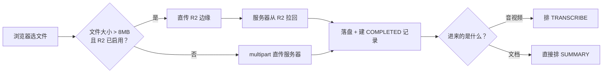

# 本地导入

不是所有录音都在飞书上：手机录的音、别人给的录屏、一份现成的会议纪要 docx，都值得进来享受同一套自建转写与纪要生成。列表页工具栏的「导入本地文件」支持音视频（mp4/mov/mkv/webm/mp3/m4a/wav/aac/ogg）与文档（txt/md/srt/docx/pdf）。

大文件走 R2 直传是为了绕开 Cloudflare 隧道：浏览器 PUT 到边缘节点，服务器再从 R2 把它拉回来（R2 出流量免费），几百兆的录屏不至于把隧道卡死。临时对象放在会议自己的前缀下（`meetings/{owner}/{token}/import/`），收完就删。上传进度用 XHR 而不是 fetch —— fetch 没有上传进度事件。

几点值得知道的：

- **文档会被转成飞书同款的转写格式。** 下游的一切（纪要提示词、时间锚点、划词提问、参会人解析）都按那个格式读。`.srt` 自带时间轴直接用；其余格式按段落编一条递增的假时间轴，锚点跳转能落到大致对应的段落上，比全部堆在 `00:00:00` 有用得多。
- **纯文本会议不排自建转写。** 它算不出覆盖率（没有段首时间戳），硬算会得出 0 并误判成「被截断」，所以导入时就自报 `transcript_source=import`，跳过那套判定。
- **单文件上限 5GB**，是 R2 单次 PUT 的限制；更大的文件建议放到服务器本地目录再导入，本轮没做分片上传。
- **直传被拦会自动回退。** 如果桶 CORS 没放开 PUT（怎么配见 [README](../README.md#3-桶-cors浏览器要直接连-r2)），预检就会被浏览器挡下，此时一个字节都还没发出去，前端会静默改走服务器上传；已经传了一半才断的不回退，免得几百兆重传一遍。
- **导入的会议在飞书上不存在。** 标识是 `imp` + 20 位随机十六进制，库里 `event_type` 记成 `LOCAL_IMPORT`，所有飞书专属操作（重下、切回飞书转写）都靠它识别并明确拒绝。
