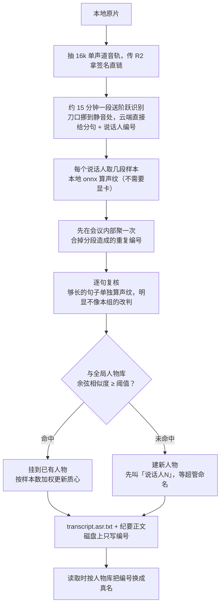

# 自建转写与声纹

启用步骤（下模型、填 `.env`）在 [根目录 README](../README.md#启用自建转写与声纹)，这里讲它为什么这么设计。

飞书免费版只转写录音的前几分钟，剩下的只给完整音视频。拿一份三分钟的转写去概括一小时的会，写出来的纪要没法看，而用户自己察觉不到。所以下载完成后会先算一次覆盖率——转写末条时间戳除以录音时长——低于阈值就判定为截断，改走这条链路，跑完再进纪要。

几点值得知道的：

- **飞书原文不覆盖。** 自建转写另存 `transcript.asr.txt`，读取时优先它，飞书的 `transcript.txt` 原样保留。
- **改名立刻全站生效，纪要也算在内。** 磁盘上转写与纪要正文写的都是会议内稳定编号，真名在读取时现查现换，所以超管改一次名，历史会议的转写页、纪要、导出件一起变，不用重跑任何东西。为此提示词要求模型称呼参会人时原样照抄转写里的标识，不许改写成「第二位发言人」这类说法。
- **转写与纪要都只存本地。** 换名发生在读取的那一刻，正文由后端直接读盘、贴好名字再随接口返回，不进 R2 也没有直链。
- **重跑转写会连带重跑纪要。** 说话人编号是每次转写重新排的，旧纪要的编号会对到新人身上，所以转写作业跑完会强制重生成纪要。
- **人物库全站共享，只有超管能命名。** 超管侧栏有「声纹人物」页，可以列出人物、试听样本、命名、合并、删除；会议详情页的转写侧也有就地改名入口。普通用户只看结果。
- **只对新会议生效。** 历史会议不自动补跑，需要时手动重下触发，或走 [手动切换转写引擎](transcript-engine-switch.md)。

## 阈值是怎么定的

匹配阈值 0.55 是拿真实录音试出来的：同一个人跨会议的质心相似度最低 0.68，不同人之间最高 0.42，取中间且偏保守，宁可判成新人也不要把两个人并成一个。

覆盖率与声纹阈值都属于业务阈值，首次启动写入 `system_configs`，之后改超管「系统配置」页即可，不必重启。

## 逐句复核

云端分离有个短板：它只在单次调用内部分人，两个人声音接近时会把整句安错，而声纹层是按「组」取样的，错的句子会一直跟着错的组走。

所以够长的句子会单独算一次声纹，跟本场各人的质心比，明显更像别人才改判。门槛（`SPEAKER_VERIFY_MARGIN`）留得高，宁可漏掉几句，也不要把本来对的搅乱；太短的句子声纹不稳，直接跳过。

## 为什么要分段，以及刀口挪到哪

整段几十分钟送上去会被识别服务拒收，所以要切。切点不是按整数倍硬切：在 15 分钟处前后各 15 秒找一段静音，把刀口挪到没人说话的地方，找不到才留在原位。硬切会把一句话劈成两半，两边各得到一个残缺分句，接缝处的人还会因为分属两次调用而多出一个待认的候选。

单段被拒会先原样重试，再不行才对半切——切得越碎，云端给的说话人编号越独立，反而更难认人。

## 依赖

这条链路依赖 R2（音频要有公网直链给识别服务）与本机 `ffmpeg`。关掉 `STEP_ASR_ENABLED` 就退回只用飞书转写。音轨从哪来见 [媒体存储](media-storage.md#音轨从哪来)。
