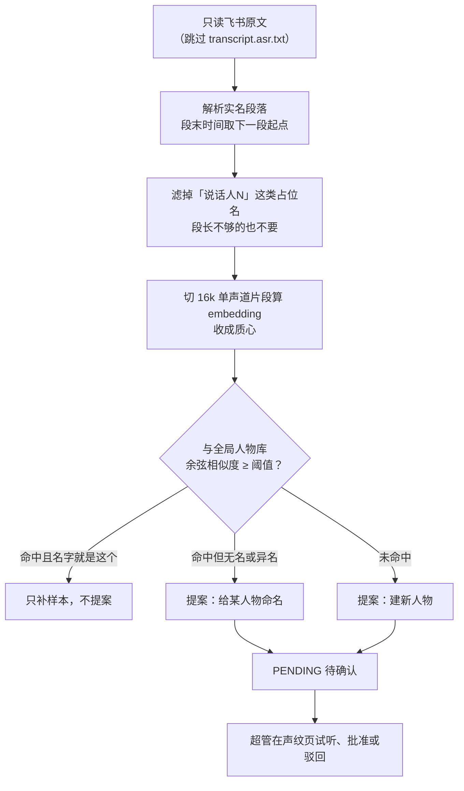

# 从飞书姓名自动建声纹

飞书转写里的段头写的是真名，这是难得的免费标注；缺的只是「这个名字对应什么声音」。所以沿用飞书转写的会议（也就是没被截断、不需要自建转写的那些）下载完会顺手排一条 `VOICEPRINT` 作业，把每位实名发言人的声音提炼成质心，拿去和全局人物库比一比。它和纪要作业互不阻塞，提炼不成也不影响这场会议的其他产物。

前置条件和 [自建转写](transcription-and-voiceprint.md) 一样：R2、本机 `ffmpeg`、下载好的声纹模型；再加上本地得有飞书原文（自建转写里只有「说话人N」，没有真名可蹭）。任一条不满足就不入队，并在日志里写明原因，不留失败作业。



**结果一律只落提案，绝不直接改人物库。** 姓名可信，但飞书的发言人切分会串行——同一段里混进别人的话是常事，这也正是需要声纹复核的原因。所以提案列表把相似度和样本数摆在显眼位置，低分的让人一眼看出得试听核对。批准时若提案指向已有人物就写上 `display_name` 并按样本数加权合并质心，否则新建一个带名字的人物，然后补样本、刷这场会议的参会人。

同一场会议重跑提炼会先清掉上一轮没人处理的 PENDING 提案，免得越堆越长。作业并发上限 1（和自建转写一样吃 CPU 和 ffmpeg）。

提案表是 `voiceprint_name_proposals`，主表 `voiceprints` 不动；人物的来源信息由提案表自己承载。开关在超管「系统配置」的 `VOICEPRINT_HARVEST_ENABLED`。除了自动入队，超管还能对单场会议手动触发：

```
POST /api/v1/admin/voiceprints/harvest/{minute_token}
```
